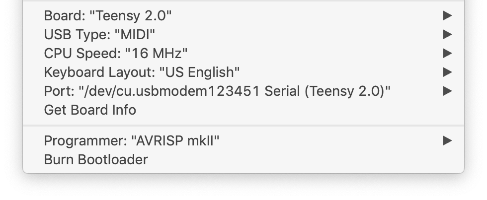
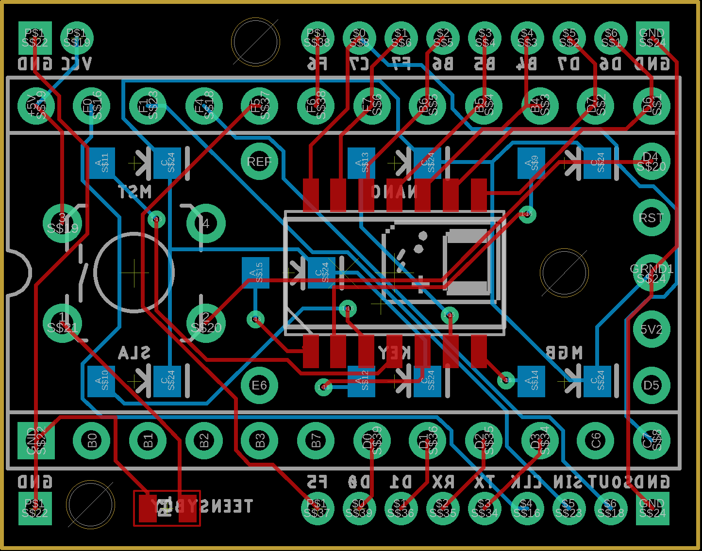

# Teensyboy 1.2.4
#### Arduinoboy Firmware for [Teensy 2.0](https://www.pjrc.com/store/teensy.html)

The [Arduinoboy](https://github.com/trash80/Arduinoboy) code has been modified to work on a [Teensy 2.0](https://www.pjrc.com/store/teensy.html) using [USBMidi](https://www.pjrc.com/teensy/td_midi.html).

The only differences between Arduinoboy and Teensyboy are different pin input and output and all Midi code has been changed to using USB Midi instead of analog serial Midi. For more informations please visit [noizeinabox.blogspot.com/2012/12/teensyboy.html](http://noizeinabox.blogspot.com/2012/12/teensyboy.html), or read on!


---

### Modes

The LED's will lightup depending on the mode Tennsyboy is in.

| LSDJ `Slave` | LSDJ `Master` | LSDJ `KEYBD` | Nanoloop | mGB | LSDJ `MIDIMAP` | LSDJ `MIDIOUT` |
|------------|-------------|---------------|----------|-----|--------------|--------------|
| :red_circle: | :white_circle: | :white_circle: | :white_circle: | :white_circle: | :red_circle: | :red_circle: |
| :white_circle: | :red_circle: | :white_circle: | :white_circle: | :white_circle: | :red_circle: | :red_circle: |
| :white_circle: | :white_circle: | :red_circle: | :white_circle: | :white_circle: | :white_circle: | :red_circle: |
| :white_circle: | :white_circle: | :white_circle: | :red_circle: | :white_circle: | :white_circle: | :red_circle: |
| :white_circle: | :white_circle: | :white_circle: | :white_circle: | :red_circle: | :white_circle: | :red_circle: |


**LSDJ `Slave` Mode**

This mode allows you to control the LSDJ sequencer and tempo from your Midi host using Midi commands.

- `48` - C-2 Sends a Sequencer Start Command
- `49` - C#2 Sends a Sequencer Stop Command
- `50` - D-2 Toggles Normal Tempo
- `51` - D#2 Toggles 1/2 Tempo
- `52` - E-2 Toggles 1/4 Tempo
- `53` - F-2 Toggles 1/8 Tempo


**LSDJ `Master` Mode**

This mode allows you to control the LSDJ sequencer and tempo from your Midi host using Midi commands.


**LSDJ `KEYBD` Mode**

This mode allows you to control LSDJ from your Midi host using Midi commands in the same way you can use a [keyboard (p.62)](https://www.littlesounddj.com/lsd/latest/documentation/LSDj_5_8_4.pdf#62).

- `48` - C-2 Mute Pu1 Off/On
- `49` - C#2 Mute Pu2 Off/On
- `50` - D-2 Mute Wav Off/On
- `51` - D#2 Mute Noi Off/On
- `52` - E-2 Livemode Cue Sequence
- `53` - F-2 Livemode Cursor Up
- `54` - F#2 Livemode Cursor Down
- `55` - G-2 Livemode Cursor Left
- `56` - G#2 Livemode Cursor Right
- `57` - A-2 Table Up
- `58` - A#2 Table Down
- `59` - B-2 Cue Table
- `60` - C-3 to C-8 Notes!
  Program Change to select from instrument table


**LSDJ Nanoloop Mode**

This mode allows you to sync to [Nanoloop](http://nanoloop.de).


**LSDJ `MIDIMAP` Mode**


**LSDJ `MIDIOUT` Mode**

Each of the 4 gameboy channels send MIDI data on 4 Midi channels by the use of effects commands. This requires a special version of LSDJ, which can be found on the [LSDJ site](http://littlesounddj.com/lsd/latest/full_version/).

* `Nxx` - Sends a MIDI Note - Absolute to the value placed in the effect. N00 sends note off, `N01`-`N6F` send Midi notes 1 to 112.
* `Qxx` - Sends a [MIDI Note](http://www.electronics.dit.ie/staff/tscarff/Music_technology/midi/midi_note_numbers_for_octaves.htm) relative to the current channel's pitch. The effect value is a offset. so `Q0C` in `PU1` would send a note 1 octave higher than what `PU1` is currently playing. This is useful as a table command to track Midi notes as normal notes in the sequencer.
* `Xxx` - Sends a MIDI CC - By default in Arduinoboy the high nibble selects a CC#, and the low nibble sends a value `0-F` to `0-127`. This can be changed to allow just 1 Midi CC with a range of `00`-`6F`, or 7 CCs with scaled or unscaled values.
* `Yxx` - Sends a program/patch/preset change.

By default each channel of LSDJ is mapped to Midi channels 1-4. For example note commands from PU1 will be sent to Midi channel 1.


---

### Compiling
Make sure you've got the board settings correct in order to compile. If you're new to developing on the Teensy be sure to checkout [Teensy Tutorial 1: Software Setup](https://www.pjrc.com/teensy/tutorial.html).

- Board: Teensy 2.0
- USB Type: MIDI
- CPU Speed: 16 MHz
- ...
- Programmer: AVRISP mkII



If you want the device to appear with the Midi device name "`Teensyboy`", run the included shell script `RENAME.sh`.

```bash
$ chmod u+x ./RENAME.sh
$ ./RENAME.sh
```

If you wish to revert back to original "`Teensy MIDI`" device name, simply run:

```bash
$ ./RENAME.sh --revert
```


---

### Hardware



There isn't nearly enough demand for me to supply pre-build boards, and if that's what you're looking for I suggest [Catskull's Teensyboy](https://catskullelectronics.com/teensyboy). However, if you're a keen DIY-type and have a [Teensy 2.0](https://www.pjrc.com/store/teensy.html) lying around, you can order the above board from [Oshpark](https://oshpark.com/shared_projects/opGtJ1PQ).

**BOM**

If you're looking to build out the above board, you'll need to order some components. I've opted to use SMD components in order to keep the footprint as small as possible. It's possible to [hand solder SMD components](https://www.youtube.com/results?search_query=diy+smd+soldering) with a soldering iron, but it does take time and patience. Here's the listing of all the components you'll need:

| Qty. | Mfr. # | Name | Price (total) USD |
|------|--------|------|-----------|
| 6    | L130-4090001400001 | [High Power LEDs - White High Power LEDs - White Neutral White, 4000K](https://www.mouser.com/ProductDetail/997-L130-40901400001) | $1.32	|
| 1   | B3F-1000 | [Tactile Switches Tactile Switches 6X6 Flat 4.3mm Btn Force 100g w/o Grd](https://www.mouser.com/ProductDetail/653-B3F-1000) | $0.25	|
| 1   | 4814P-1-331LF | [Resistor Networks & Arrays Resistor Networks & Arrays 330ohm 2% 14 Pin](https://www.mouser.com/ProductDetail/652-4814P-1LF-330) | $1.13 |
| 1  | ERJ-6RQF1R2V | [SMD 0805 1.2ohm 1% Curr Sense AEC-Q200](https://www.mouser.com/ProductDetail/Panasonic/ERJ-6RQF1R2V?qs=%2Fha2pyFadui47ij%252B%252BE9lBGtsgYz%252BC2cFH71kj31BFLO4mPpT4%2FJgeA%3D%3D) | $0.53 |
| | | | |
| **Total** | | | $3.23 |

<br>

**Gameboy pins**
- Gameboy Clock line on analog in `PF0`
- Gameboy Serial Data input on analog in `PF1`
- Serial Data from gameboy on analog in `PF4`


**Teensy pin settings:**
- 6 LEDS on pins `11` to `16`
- Push button on pin `22` (for selecting mode)
- Status Led on pin `10`
- Gameboy Clock line on analog in pin `21`
- Gameboy Serial Data input on analog in pin `20`
- Serial Data from gameboy on analog in pin `19`


---

### Credit

Original Arduinoboy developer
- [Timothy Lamb](trash80@gmail.com)
- [https://github.com/trash80/Arduinoboy](https://github.com/trash80/Arduinoboy)

Arduinoboy modified for Teensy 2; Teensyboy
- [noizeinabox](noizeinabox@gmail.com)
- [http://noizeinabox.blogspot.com/](http://noizeinabox.blogspot.com/)

Minor updates, refactoring, and documentation additions
- [Ken Frederick](ken.frederick@gmx.de)
- [https://github.com/frederickk](https://github.com/frederickk)


---

### Change log

Teensyboy Based on Arduinoboy Version: 1.2.3

**Teensyboy version 1.2.4**
- 5 May 2019
- Updated files for TeensyLib are no longer needed, code has been refactored accordingly
- Add Midi Clock sync to MIDI_OUT mode
- Added RENAME.sh to rename the Midi device to "Teensyboy"
- Refactored code structure


**Teensyboy version 1.2.3 Rev 2.2**
- 8 July 2012
- Changed MGB mode :send to GB delay -> 500us (should fix notes drop)


**Teensyboy version 1.2.3 Rev 2.1**
- 20 Nov 2012
- Based on Original code of Timothy Lamb
- modified for Teensy by noizeinabox@gmail.com


---

### License

This program is free software; you can redistribute it and/or modify it under the terms of the GNU General Public License as published by the Free Software Foundation; either version 2 of the License, or (at your option) any later version.


