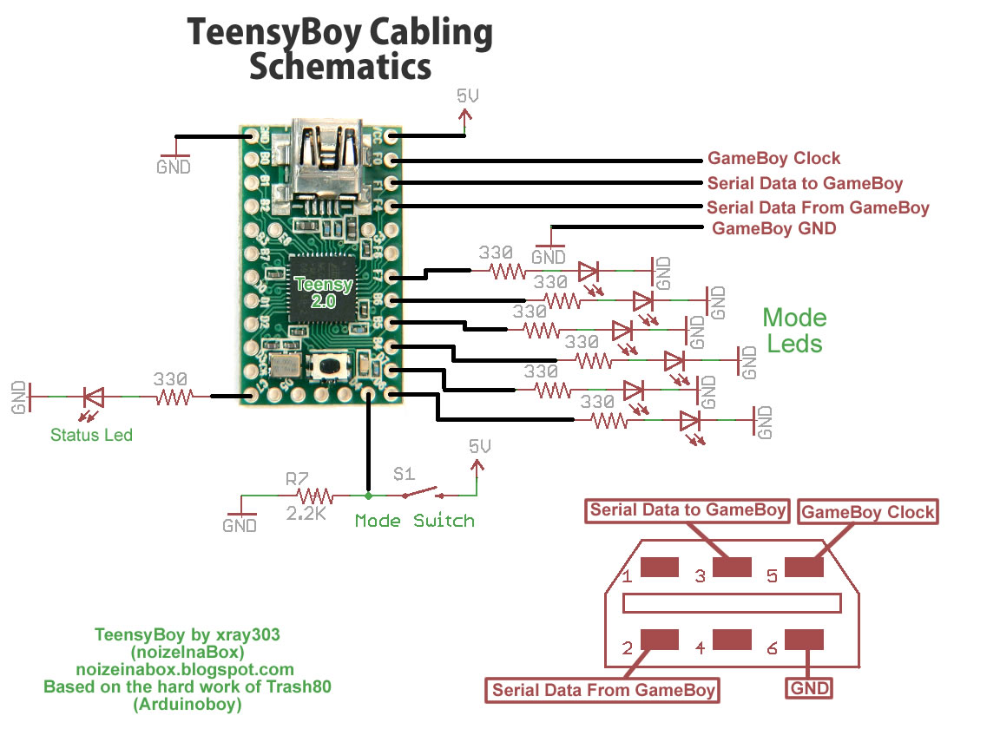

# Teensyboy 1.2.3
#### Arduinoboy Firmware for [Teensy 2.0](https://www.pjrc.com/store/teensy.html)

The [Arduinoboy](https://github.com/trash80/Arduinoboy) code has been modified to work on a Teensy using USBMidi.

The only differences between Arduinoboy and Teensyboy are different pin input and output and all midi code has been changed to using usb midi instead of clasic serial midi. For more informations please visit the blog at [noizeinabox.blogspot.com/2012/12/teensyboy.html](http://noizeinabox.blogspot.com/2012/12/teensyboy.html).

Arduinoboy code for Teensy modified by:

- [noizeinabox](noizeinabox@gmail.com)
- http://noizeinabox.blogspot.com/

Original Arduinoboy developer
- [Timothy Lamb](trash80@gmail.com)
- https://github.com/trash80/Arduinoboy

### Modes

The LED's will lightup depending on the mode Tennsyboy is in.

| LSDJ `Slave` | LSDJ `Master` | LSDJ `KEYBD` | Nanoloop | mGB | LSDJ `MIDIMAP` | LSDJ `MIDIOUT` |
|------------|-------------|---------------|----------|-----|--------------|--------------|
| :red_circle: | :white_circle: | :white_circle: | :white_circle: | :white_circle: | :red_circle: | :red_circle: |
| :white_circle: | :red_circle: | :white_circle: | :white_circle: | :white_circle: | :red_circle: | :red_circle: |
| :white_circle: | :white_circle: | :red_circle: | :white_circle: | :white_circle: | :white_circle: | :red_circle: |
| :white_circle: | :white_circle: | :white_circle: | :red_circle: | :white_circle: | :white_circle: | :red_circle: |
| :white_circle: | :white_circle: | :white_circle: | :white_circle: | :red_circle: | :white_circle: | :red_circle: |

**LSDJ `Slave` Mode**
 Midi Note Effects:

- `48` - C-2 Sends a Sequencer Start Command
- `49` - C#2 Sends a Sequencer Stop Command
- `50` - D-2 Toggles Normal Tempo
- `51` - D#2 Toggles 1/2 Tempo
- `52` - E-2 Toggles 1/4 Tempo
- `53` - F-2 Toggles 1/8 Tempo

**LSDJ `KEYBD` Mode**

- `48` - C-2 Mute Pu1 Off/On
- `49` - C#2 Mute Pu2 Off/On
- `50` - D-2 Mute Wav Off/On
- `51` - D#2 Mute Noi Off/On
- `52` - E-2 Livemode Cue Sequence
- `53` - F-2 Livemode Cursor Up
- `54` - F#2 Livemode Cursor Down
- `55` - G-2 Livemode Cursor Left
- `56` - G#2 Livemode Cursor Right
- `57` - A-2 Table Up
- `58` - A#2 Table Down
- `59` - B-2 Cue Table
- `60` - C-3 to C-8 Notes!
  Program Change to select from instrument table

**LSDJ `MIDIOUT` Mode**

Each of the 4 gameboy channels send MIDI data on 4 midi channels by the use of effects commands. This requires a special version of LSDJ, which can be found on the [LSDJ site](http://littlesounddj.com/lsd/latest/full_version/).

* `Nxx` - Sends a MIDI Note - Absolute to the value placed in the effect. N00 sends note off, `N01`-`N6F` send midi notes 1 to 112.
* `Qxx` - Sends a [MIDI Note](http://www.electronics.dit.ie/staff/tscarff/Music_technology/midi/midi_note_numbers_for_octaves.htm) relative to the current channel's pitch. The effect value is a offset. so `Q0C` in `PU1` would send a note 1 octave higher than what `PU1` is currently playing. This is useful as a table command to track midi notes as normal notes in the sequencer.
* `Xxx` - Sends a MIDI CC - By default in Arduinoboy the high nibble selects a CC#, and the low nibble sends a value `0-F` to `0-127`. This can be changed to allow just 1 midi CC with a range of `00`-`6F`, or 7 CCs with scaled or unscaled values.
* `Yxx` - Sends a program/patch/preset change.

By default each channel of LSDJ is mapped to midi channels 1-4. For example note commands from PU1 will be sent to midi channel 1. 

### Compiling
Make sure you've got the board settings correct in order to compile. If you're new to developing on the Teensy be sure to checkout [Teensy Tutorial 1: Software Setup](https://www.pjrc.com/teensy/tutorial.html).

- Board: Teensy 2.0
- USB Type: MIDI
- CPU Speed: 16 MHz
- ...
- Programmer: AVRISP mkII

### Hardware

**Gameboy pins**
- Gameboy Clock line on analog in `PF0`
- Gameboy Serial Data input on analog in `PF1`
- Serial Data from gameboy on analog in `PF4`

**Teensy pin settings:**
- 6 LEDS on pins `11` to `16`
- Push button on pin `22` (for selecting mode)
- Status Led on pin `10`
- Gameboy Clock line on analog in pin `21`
- Gameboy Serial Data input on analog in pin `20`
- Serial Data from gameboy on analog in pin `19`

### Change log
Teensyboy Based on Arduinoboy Version: 1.2.3

**Teensyboy version 1.2.3 Rev 2.3**
- 5 May 2019
- Updated files for TeensyLib are no longer needed, code has been refactored accordingly

**Teensyboy version 1.2.3 Rev 2.2**
- 8 July 2012
- Changed MGB mode :send to GB delay -> 500us (should fix notes drop)

**Teensyboy version 1.2.3 Rev 2.1**
- 20 Nov 2012
- Based on Original code of Timothy Lamb
- modified for Teensy by noizeinabox@gmail.com

### License
This program is free software; you can redistribute it and/or modify it under the terms of the GNU General Public License as published by the Free Software Foundation; either version 2 of the License, or (at your option) any later version.

